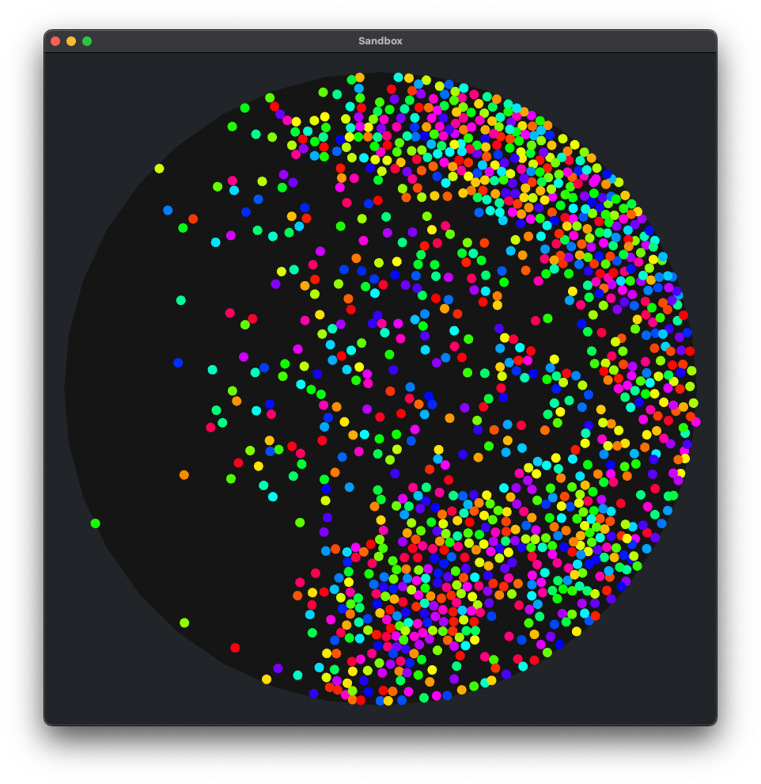
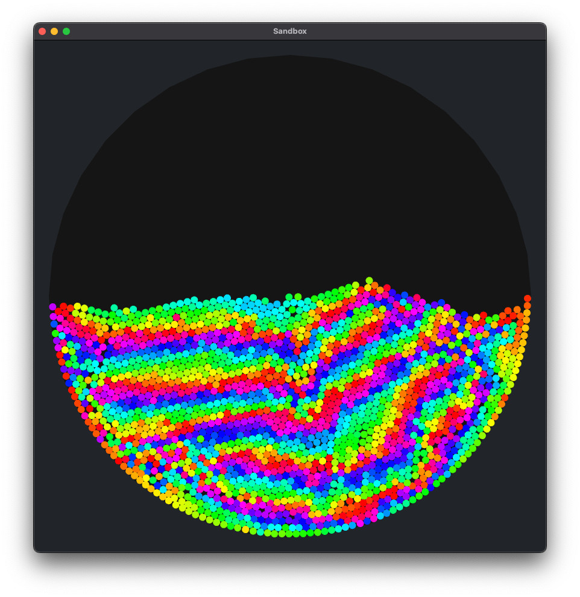
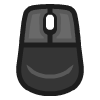
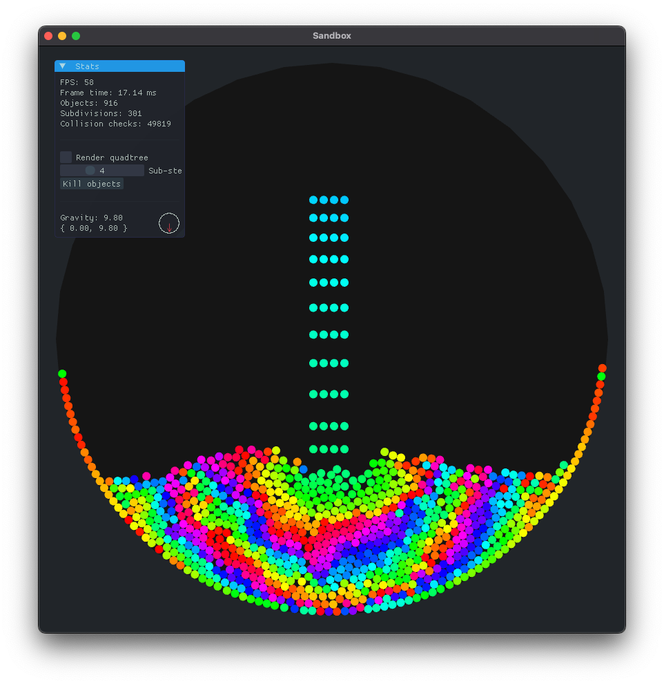

# C++ Simple physics engine

Implements a simple physics engine in C++ based on [Verlet integration](https://en.wikipedia.org/wiki/Verlet_integration) and [Verlet constraints](https://en.wikipedia.org/wiki/Verlet_integration#Verlet_constraints).

    

        
        
    

 <a href="https://leandrosq.github.io/cpp-physics-sandbox/">Live demo here</a>

## About

You can check the WEB version [here](https://leandrosq.github.io/cpp-physics-sandbox/). It is a port using WASM generated by Emscripten using WebGL on the browser.

* Restricted only to circles
* Supports gravity
* Supports collisions
  * Implements a Quadtree for collision detection
* Supports constraints
  * Implements both a circle and a rectangle world constraint
* Supports user interaction
  * Dragging
  * Spawning
  * Explode

## Controls

### Desktop

>  `Left click` to spawn circles

>  `Right click` to drag circles

>  `Middle click` to explode circles

>  `Space bar` to flip the Gravity vector

>  `Up arrow` to increase the Gravity force

>  `Down arrow` to decrease the Gravity force

>  `Left arrow` to decrease the Gravity angle

>  `Right arrow` to increase the Gravity angle

>  `ESC` to exit

    Other controls included on the GUI can be used with the mouse as demonstrated below.
    

## Project

### Resources

| Name | Description |
| -- | -- |
| [ClangD](https://clangd.llvm.org/) | Language Server for C++ |
| [CMake](https://cmake.org/) | Cross-platform open-source make system |
| [Clang-tidy](https://clang.llvm.org/extra/clang-tidy/) | A clang-based C++ “linter” tool |
| [Clang-format](https://clang.llvm.org/docs/ClangFormat.html) | A tool to format C/C++/Obj-C code |
| [Emscripten](https://emscripten.org/) | Used for the web port, generating the WASM binaries. |
| [Raylib](https://www.raylib.com/) | A simple and easy-to-use library to enjoy videogames programming |
| [Dear ImGui](https://www.github.com/ocornut/imgui) | Bloat-free Immediate Mode Graphical User interface for C++ with minimal dependencies |
| [Dear ImGui Raylib](https:://github.com/RobLoach/raylib-imgui) | Dear ImGui bindings for Raylib |
| [NES CSS](https://nostalgic-css.github.io/NES.css/) | NES.css is NES-style (8bit-like) CSS Framework. |
| Github Actions | Used for CI/CD |
| Github Pages | Used for hosting the web version |
